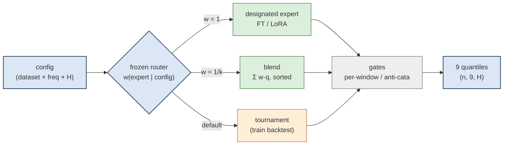
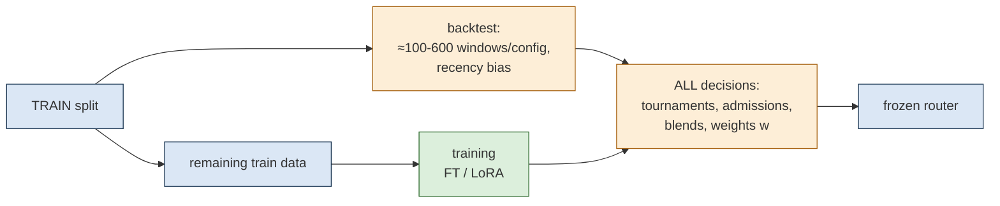
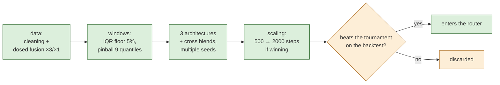

# TW3Cast — Technical Report

*Time-series forecasting system evaluated on GIFT-Eval (Salesforce, 97 configurations):
a lightweight router over specialized models — no agent, no LLM at inference.*

---

## 1. Overview

TW3Cast is a **router-based system**: for every benchmark configuration (a dataset ×
frequency × horizon triple), a router selects — **based on the configuration name** — the
model, or blend of models, that will produce the forecasts. The router makes no decision at
prediction time: every decision was made beforehand, exclusively from the training set, and is
frozen into a **logits table** (`router.csv`: configuration → experts → mixture weights).

Two families of experts feed the router: **specialized models** (fine-tunes and LoRA of public
foundation models, one per configuration — the preferred path), and **the tournament**, the
system's default mode, which automatically selects the served model wherever no specialist
reaches the required level. Nothing in the method depends on the configuration names: the
logits table is merely the *frozen* form of the system for a known benchmark (§6).

## 2. The protocol: every decision is made on a backtest extracted from the train split

Every decision — which specialist to keep, which model wins a tournament, which blends to
serve — is made on a **backtest built by extracting windows from the train split**: context +
horizon windows are sliced from the end of the train split (recency bias: the most recent
windows are the closest to real forecasting conditions, old regimes mislead selection;
multiple cuts per series; identified hourly regimes), and every candidate is evaluated there
exactly as in the benchmark: MASE = mean|y − ŷ₀.₅| / mean|yₜ − yₜ₋ₛ| (s = seasonal period)
and CRPS approximated by the mean pinball loss over the 9 quantiles,
ρ_q(y, ŷ_q) = max(q·(y − ŷ_q), (q − 1)·(y − ŷ_q)), q ∈ {0.1, …, 0.9}. Each configuration has
roughly 100 to 600 backtest windows. **The train data not consumed by this backtest is used
to train the specialists.**

The designation rule is simple and automatic: **a LoRA or fine-tuned specialist is designated
for a configuration as soon as it beats the tournament on this backtest** — under comparable
conditions, the advantage goes to the specialist, in line with the system's philosophy: a
dedicated solution per configuration whenever possible, the tournament otherwise.

**Validating the selector itself.** A methodological contribution of this work: before
trusting any selection rule, we evaluate it with a **temporal meta-backtest** — the rule
selects on the *older* backtest windows and its choice is scored on the *recent* ones, over
hundreds of draws. This temporal protocol ranks selection rules correctly — where a random
split of the same windows fails: it favors over-flexible rules — and lets us iterate on
selection rules at no cost, entirely inside the backtest.

## 3. The specialized experts: data preparation makes the model

The central contribution is not fine-tuning per se, but **how the data is prepared**. With an
identical dataset, results vary widely depending on the treatment applied — this work
demonstrates that fine-tunes become excellent when the data is intelligently cleaned and
enriched.

### 3.1 Train cleaning

Before any training, every corpus is filtered series by series:

- **degenerate series** — near-zero variance, constant or few-valued series: they crush the
  loss and teach nothing;
- **scale outliers** — series whose magnitude is inconsistent with the corpus (failing
  sensors, mixed units): a single one can dominate the gradient;
- **corrupted segments** — missing or frozen stretches, truncated rather than imputed;
- **per-source volume caps** in fusions, so that no dataset drowns the others.

The effect is major: on several configurations, cleaning alone separates a mid-table result
from a top-tier one. Cleaning is also *contextual*: on a 21-series weather
dataset, fusing with a large neighboring corpus drowned the signal — the cleaned solo wins;
the opposite holds for data-poor datasets. General rule: **data-rich configuration → dedicated
specialist on cleaned data; data-poor configuration → enriched family**.

### 3.2 Enrichment: dosed fusion

For data-poor configurations, the target's train is mixed with the trains of **sibling**
configurations (same domain or frequency): **target over-weighting** (typically target ×3 +
siblings ×1 — siblings regularize, the target remains the signal), **strict truncation** to
the allowed training perimeter, families built by similarity (frequency × horizon, then
domain), and "enriched with rich siblings" variants for entirely poor families. On top of
this: **full fine-tuning for rich families, LoRA for poor ones** (LoRA regularizes where data
is scarce), **multiple seeds** on unstable targets, and **conditional scaling** — a short run
(500 steps) is extended (2000 steps) only if it already wins.

### 3.3 Controlled window training

Training reproduces the evaluation conditions: window sampling (variable-length contexts,
target = full horizon or next patch depending on the architecture), **robust residual
normalization**: z = (x − med(c)) / s(c) with s(c) = max(IQR(c), 0.05 · range(c)), then
clipping |z| ≤ 20 — without this floor and this clipping, the loss is dominated by outliers.
The loss is the **pinball over the benchmark's own 9 quantiles**, L = Σ_q ρ_q(z_y, ẑ_q),
sorted outputs (q̂₀.₁ ≤ … ≤ q̂₀.₉): the model learns exactly the distribution it will be
judged on. Learning rates: 10⁻⁴ for LoRA, 10⁻⁵ for full fine-tunes.

### 3.4 Three architectures, cross blends, calibration

Three families are specialized — Chronos-2, TiRex, Toto 2.5B (LoRA adapters) —
each with its own recipe (native loss, patch or horizon, scaling space). **Cross-architecture
blends** (sorted quantile mean) consistently beat single-family ensembles: architecture
diversity brings more than seed diversity. A calibration refinement completes the picture: on
some configurations, the **winner's median is kept and only the outer quantiles are averaged**
with the best members — the spread calibrates without touching the central forecast.

No leaderboard system or top model is used as a component: the building blocks are plain
public foundation models. Served alone, none of them is competitive with the top systems, and
their best static fusions — without training or tournament — only marginally improve on the
best single component. The entire gap between the building blocks and the complete system is
created by data preparation, training and selection.

## 4. Intelligent tournaments and fallback gates

### 4.1 The tournament (stage 1): a selection defended against its own biases

On configurations without a retained specialist, every pool member is evaluated on the
backtest windows; the winner becomes the served model. Three original guard-rails make this
selection robust:

- **dual MASE + CRPS criterion**: candidates with degenerate quantiles (nine identical
  quantiles) can win on MASE alone while being probabilistically useless — the dual criterion
  eliminates them;
- **asymmetric anti-memorization margin**: a *locally trained* candidate has seen these series
  during training — its backtest score is structurally flattered. It is only admitted if
  S(local) < (1 − δ) · min_generic S, with **δ = 12%**, and without being worse on CRPS. This
  calibrated asymmetry is what allows specialists and generic models to coexist fairly in one
  tournament;
- **probabilistic tie-breaking and switch to the blend**: near-ties (gap < 3%) are settled on
  CRPS; and if the heavyweight blend is within 5% of the winner, the blend is served — a win
  by a hair is most often backtest noise. "When choosing is uncertain, blend."

### 4.2 The per-window gate (stage 2): catching local failures

At prediction time, every window is checked by a lightweight backtest of its own context, on
**two segments** (the final segment, of length H, and the middle segment). A window is
rerouted to another member only if **all** conditions agree: the default's error above the
threshold (τ = 1.5 for foundation models, τ = 3 for naive references), the challenger better
by at least 10% on average, better on **each** of the two segments, and better on CRPS. A
**regime-transition guard** additionally blocks any switch when the recent dormancy of the
context differs from what the segments saw (dawn/dusk of hourly series): at those transitions
the segment signal inverts and the gate would err. The result is a deliberately conservative
net: few switches, almost all of them winning.

### 4.3 The anti-catastrophe gate: the specialists' safety net

Configurations served by a specialist carry a distinct **anti-catastrophe gate** with
deliberately very high thresholds (τ = 5 to 10, i.e. 3 to 6 times the normal gate's
thresholds): it only intervenes if the specialist fails flagrantly on a window, in which case
the window is served by the generic pool. It never trims a healthy specialist — it removes
tail risk. In the same spirit, an **alignment guard** verifies by correlation that imported
predictions (caches, external wrappers) are attached to the right windows: plausible-looking
but misaligned outputs — the worst kind of error, invisible to aggregate metrics — are
rejected when the median correlation falls below 0.30 (over our campaigns: three rejections,
all justified, zero false positives).

## 5. Quality and traceability

- **Every submitted line is reproduced from a saved artifact** (weights, adapters, verified
  quantiles): the 97 forecasts of the submission file were recomposed from these artifacts and
  checked for equality on MASE and WQL before publication.
- Checkpoints are saved as `state_dict` (bit-exact reload); any reported score is that of a
  **reloaded** artifact, never of an in-memory end-of-training model.
- Evaluation strictly follows the official GIFT-Eval harness (gluonts `evaluate_forecasts`,
  leaderboard parameters), validated by reproducing a leaderboard reference model to three
  decimals.

## 6. Reproducibility beyond GIFT-Eval: a method, not a table

The essential point: **nothing in the method depends on GIFT-Eval configuration names**. The
logits table is a snapshot; the underlying system transposes as-is to external data:

- **Direct application on GIFT-Eval**: the provided table (`router.csv`) resolves each
  configuration by direct lookup — nothing to retrain or decide.
- **New data source, no training**: keep the default mode — the tournament — which builds its
  backtest on the new source's available history (same context + horizon slicing, same
  guard-rails) and selects the model to serve. This is the system's native behavior: it
  produces a "router" for any set of series, exactly as it did for the benchmark.
- **New data source, with specialization**: the §3 pipeline (cleaning → dosed fusion →
  controlled windows → conditional scaling) applies to the source's history; the resulting
  specialist **faces the tournament on the backtest** and is deployed as soon as it beats it —
  the same admission rule as on the benchmark, fallback gates included.
- **Reusing the existing specialists**: facing data close to an already-covered domain
  (energy, traffic, weather, sales…), the corresponding fine-tune or LoRA is selected as
  default — if needed by simply letting it face the tournament before deployment.
- **Fully anonymous series** (no selection history): a mini-tournament on the series' own
  past; failing that, the foundation-model blend serves as a robust floor.

## 7. Results

- The system is evaluated on all 97 benchmark configurations through the official harness
  (MASE and WQL/CRPS). About two thirds of the configurations are served by a designated
  specialist or blend, one third by the tournament.
- Per-configuration details are in the GIFT-Eval submission
  (`results/TW3Cast/all_results.csv` on the benchmark repository); the current standing can
  be read on the public GIFT-Eval leaderboard.
